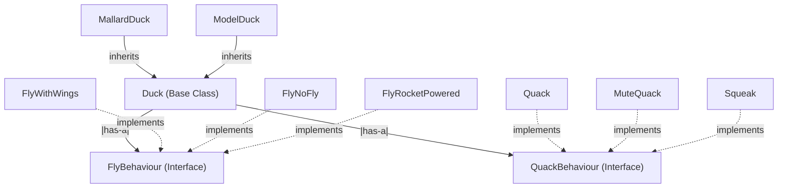

# Design Patterns Repository

This repository contains implementations of various design patterns in software development.

## Table of Contents
1. **DuckODuck - Strategy Pattern**  
   - Overview  
   - When to Use  
   - How It Works  
   - Example Usage  

---

## 1. DuckODuck - Strategy Pattern  

### Overview  
The **Strategy Pattern** defines a family of algorithms, encapsulates each one, and makes them interchangeable. It allows the algorithm to vary independently from the client that uses it.

### When to Use  
- You have multiple algorithms for a specific task.  
- You want to allow dynamic selection of algorithms at runtime.  
- You aim to separate concerns by decoupling behavior from implementation.  

### How It Works  
- The behavior (algorithm) is extracted into separate strategy classes.  
- A context class maintains a reference to a strategy object.  
- The client can switch strategies dynamically at runtime.  

### Example Usage  
Imagine a duck simulation game where different ducks can have different flying and quacking behaviors. Instead of hardcoding behaviors, the Strategy Pattern allows assigning behaviors dynamically.  

---

## Contributing  
Feel free to contribute by adding more design patterns or improving existing implementations!  

## License  
This repository is open-source and available for educational and reference purposes.  

---

### 🚀 Happy Coding!  

