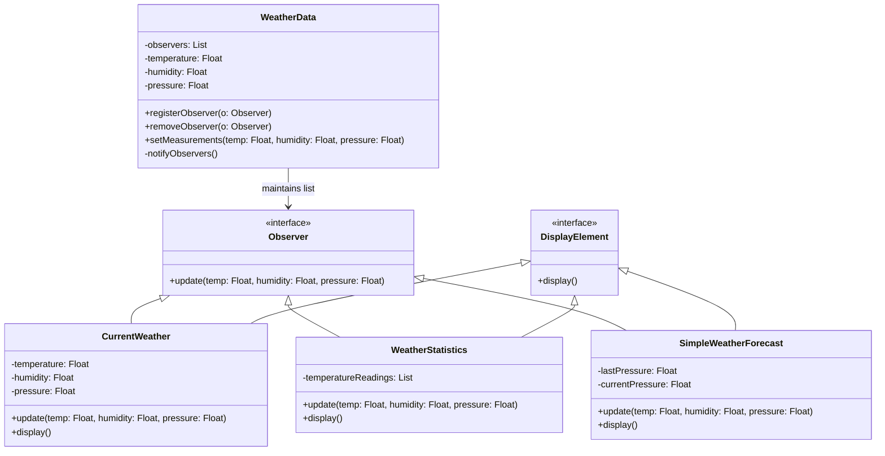

# Design Patterns Repository

This repository contains implementations of various design patterns in software development.

## Table of Contents

1. **DuckODuck - Strategy Pattern**
    - Overview
    - When to Use
    - How It Works
    - Example Usage

---

## 1. DuckODuck - Strategy Pattern

### Overview

The **Strategy Pattern** defines a family of algorithms, encapsulates each one, and makes them interchangeable. It
allows the algorithm to vary independently from the client that uses it.

### When to Use

- You have multiple algorithms for a specific task.
- You want to allow dynamic selection of algorithms at runtime.
- You aim to separate concerns by decoupling behavior from implementation.

### How It Works

- The behavior (algorithm) is extracted into separate strategy classes.
- A context class maintains a reference to a strategy object.
- The client can switch strategies dynamically at runtime.

### Example Usage

Imagine a duck simulation game where different ducks can have different flying and quacking behaviors. Instead of
hardcoding behaviors, the Strategy Pattern allows assigning behaviors dynamically.

```mermaid
graph TD
;
    Duck["Duck (Base Class)"];
    FlyBehaviour["FlyBehaviour (Interface)"];
    QuackBehaviour["QuackBehaviour (Interface)"];
    MallardDuck["MallardDuck"];
    ModelDuck["ModelDuck"];
    FlyWithWings["FlyWithWings"];
    FlyNoFly["FlyNoFly"];
    FlyRocketPowered["FlyRocketPowered"];
    Quack["Quack"];
    MuteQuack["MuteQuack"];
    Squeak["Squeak"];
    MallardDuck -->|inherits| Duck;
    ModelDuck -->|inherits| Duck;
    Duck -- |has-a|- - > FlyBehaviour ;
Duck - -|has-a|- -> QuackBehaviour ;

FlyWithWings -.->|implements| FlyBehaviour;
FlyNoFly -.->|implements|FlyBehaviour;
FlyRocketPowered -.->|implements|FlyBehaviour;

Quack -.->|implements|QuackBehaviour;
MuteQuack -.->|implements|QuackBehaviour;
Squeak -.->|implements|QuackBehaviour;

```

---

## Table of Contents

**Weather Station - Observer Pattern**
- Overview
- When to Use
- How It Works
- Example usages
---

## 2. Weather Station - Observer Pattern

### Overview

The **Observer Pattern** is a behavioral design pattern where multiple objects (observers) listen for changes in another
object (subject). When the subject updates, all registered observers are notified automatically.

### When to Use

- When multiple components need to stay synchronized with a data source.
- When you want to **decouple** subjects from observers, allowing flexible communication.
- When you need a **publish-subscribe mechanism** for real-time updates.

### How It Works

- A **Subject (WeatherData)** maintains a list of observers and notifies them of changes.
- **Observers (CurrentWeather, WeatherStatistics, SimpleWeatherForecast)** implement an `update()` method to receive
  updates.
- Observers can be added or removed dynamically from the subject.

### Example Usage
- Imagine a weather monitoring system where different components need to react to weather updates. Instead of each component manually checking for changes, the Observer Pattern allows them to be notified automatically.
---

## 📜 UML Diagram



## Contributing

Feel free to contribute by adding more design patterns or improving existing implementations!

## License

This repository is open-source and available for educational and reference purposes.

---

### 🚀 Happy Coding!  


